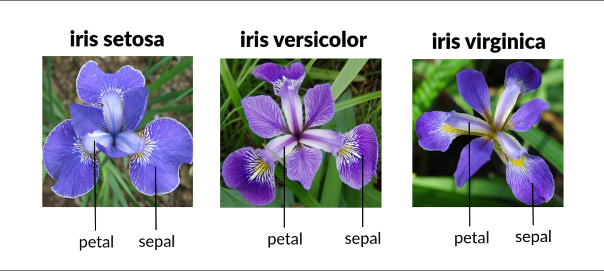

# Iris Classification App（アヤメ分類アプリ / KNNモデル）

機械学習モデル（KNN）を使用して  
**4つの計測値からアヤメの品種を分類する Web アプリ**です。

Streamlit で構築されており、ブラウザだけで利用できます。

---

## 🚀 デモアプリ（Streamlit Cloud）

👉 **アプリURL：https://app-iris-demo-ecvtbbvupa98w4xlk8jsle.streamlit.app/

> **Note:**
> Streamlit Cloud（無料プラン）はシングルスレッドで動作しており、同時接続が増えるとレスポンスが順次遅延します。
> そのため、3〜5人程度のアクセスが「安全マージンのある同時アクセス数」となります。また、3秒に1回までの実行に制限しています。

---

## 📘 アプリ概要

このアプリは、以下の 4 つの値を入力すると  
「アヤメの品種」を自動で予測します。

- がく片の長さ（Sepal Length）
- がく片の幅（Sepal Width）
- 花弁の長さ（Petal Length）
- 花弁の幅（Petal Width）

予測結果は数値とカテゴリ名で表示され、  
散布図上には入力したサンプル位置もプロットされます。

---

## 🌼 分類対象のアヤメ（Iris）の種類

以下の 3 種類の品種を分類できます：

- **Iris setosa（セトサ）**
- **Iris versicolor（バーシカラー）**
- **Iris virginica（バージニカ）**

### 参考画像（petal / sepal の位置）



---

## 🔧 使用している機械学習モデル

- **アルゴリズム**：K-Nearest Neighbors（KNN）
- **k = 3**
- **学習データ**：Iris Dataset（scikit-learn）
- **学習ファイル**：model.pkl  
　※ `train_model.py` にて生成しています。

```python
model = KNeighborsClassifier(n_neighbors=3)
model.fit(X, y)
joblib.dump(model, "model.pkl")
```

## KNNアルゴリズム概要
1. データを特徴量の点として扱う
各サンプルは複数の特徴量からなる n 次元空間の点として表現する。
（例：Iris は 4 つの特徴 → 4次元点）

2. 距離計算
未知データと既存データすべての点とのユークリッド距離を計算する。

3. 近傍点の抽出
計算した距離を 昇順に並べ、
**最も近い上位 K 個（K＝3）**を取り出す。

4. 多数決による分類
上位3つのラベルを集計し、
最も多いラベルを予測結果として出力する。
